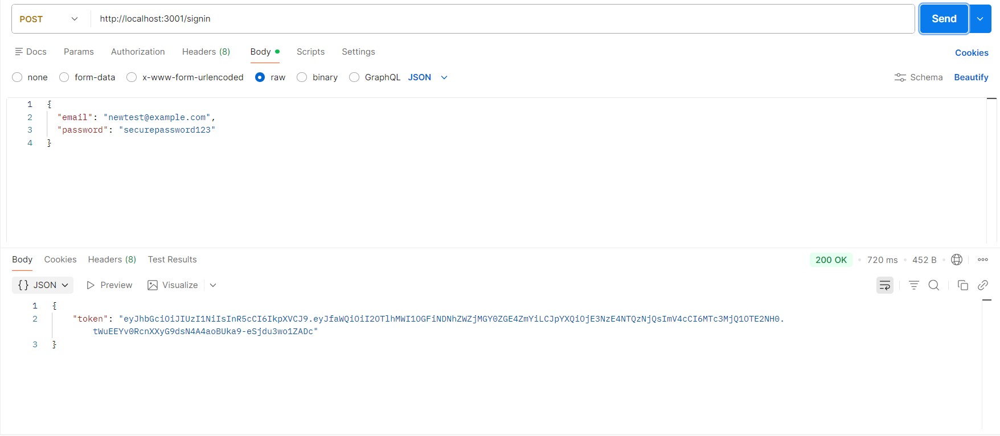
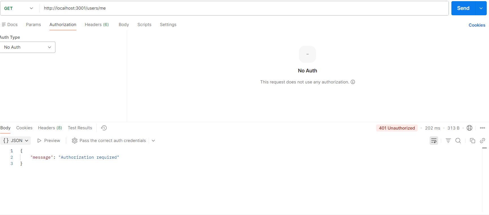
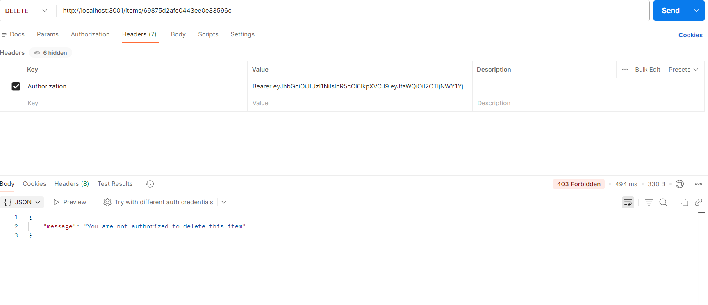

# WTWR (What to Wear?): Back End

## Project Description

WTWR is a backend application that provides API endpoints for managing users and clothing items. The application allows users to create, view, and manage a collection of clothing items, with the ability to like/unlike items. This backend is designed to work with a frontend application that helps users decide what to wear based on weather conditions. The backend also provides authentication using JWT token creation and verification while using bcrypt for password hashing.

## Running the Project

`npm run start` — to launch the server

`npm run dev` — to launch the server with the hot reload feature

## Technologies and Techniques Used

### Core Technologies

- **Node.js** - JavaScript runtime environment for server-side development
- **Express.js** - Web application framework for Node.js, used to build RESTful API endpoints
- **MongoDB** - NoSQL database for storing user and clothing item data
- **Mongoose** - ODM (Object Data Modeling) library for MongoDB, providing schema validation and data modeling
- **bcryptjs** - Library for hashing and comparing passwords securely
- **jsonwebtoken** - Library for creating and verifying JWT tokens for authentication
- **validator** - Library for validating email addresses and URLs
- **cors** - Middleware for enabling cross-origin resource sharing

### Development Tools

- **Nodemon** - Development utility that automatically restarts the server when file changes are detected
- **ESLint** - Code linting tool to maintain code quality and consistency
- **Postman** - API testing and development platform

## Features

### User Management

- Create new users with name and avatar, email and hashed password
- User login returning a JWT token
- Retrieve all users
- Retrieve current logged-in user profile
- Update current user profile

### Authentication

- User signup with bcrypt password hashing
- User login with JWT token creation
- Protected routes requiring a valid token
- Users can only delete their own clothing items

### Clothing Item Management

- Create new clothing items with name, weather type, and image URL
- Retrieve all clothing items
- Delete clothing items (owner only)
- Like/unlike clothing items

### Error Handling

- Comprehensive error handling with appropriate HTTP status codes:
  - **400** - Bad Request (invalid data or invalid ID format)
  - **401** - Unauthorized (invalid token or incorrect credentials)
  - **403** - Forbidden (attempting to delete another user's item)
  - **404** - Not Found (resource doesn't exist)
  - **409** - Conflict (duplicate email on signup)
  - **500** - Internal Server Error (server-side errors)
- Centralized error constants for consistency
- Detailed error messages for better debugging

### Data Validation

- Schema validation using Mongoose
- Email validation using validator package
- URL validation for avatar and image URLs
- String length validation for names
- Enum validation for weather types (hot, warm, cold)

## Key Techniques Implemented

### Middleware

- **JSON Parser** - `express.json()` middleware to parse incoming JSON request bodies
- **Auth Middleware** - JWT verification middleware that protects routes
- **CORS** - Configured to allow cross-origin requests
- **404 Handler** - Catches requests to non-existent routes

### Mongoose Methods

- **`.find()`** - Retrieve all documents from a collection
- **`.findById()`** - Retrieve a single document by ID
- **`.create()`** - Create new documents
- **`.findByIdAndDelete()`** - Find and delete a document by ID
- **`.findByIdAndUpdate()`** - Find and Update a document by ID
- **`.orFail()`** - Helper method to throw an error when a document is not found

### MongoDB Operators

- **`$addToSet`** - Adds a value to an array only if it doesn't already exist (used for liking items)
- **`$pull`** - Removes a value from an array (used for unliking items)

### Code Organization

- **MVC Pattern** - Models, Controllers, and Routes are separated for better maintainability
- **Centralized Error Constants** - Error codes and messages stored in a utilities file
- **Modular Routing** - Separate route files for users and clothing items

## Project Structure

````
wtwr-backend/
├── models/
│   ├── user.js              # User schema and model
│   └── clothingItem.js      # Clothing item schema and model
├── controllers/
│   ├── users.js             # User-related controller logic
│   └── clothingItems.js     # Clothing item-related controller logic
├── routes/
│   ├── users.js             # User route definitions
│   └── clothingItems.js     # Clothing item route definitions
|   |__ index.js
├── utils/
|   |__ config.js
│   └── errors.js            # Centralized error codes and messages
├── app.js                   # Main application entry point
└── package.json             # Project dependencies and scripts


## API Endpoints

### Authentication (public)

- **POST** `/signup` - Create a new user account
- **POST** `/signin` - Login and receive a JWT token

### Users (Protected)

- **GET** `/users` - Get all users
- **GET** `/users/me` - Get current logged-in user
- **PATCH** `/users/me` - Update current user profile

### Clothing Items

- **GET** `/items` - Get all clothing items (public)
- **POST** `/items` - Create a new clothing item (protected)
- **DELETE** `/items/:itemId` - Delete a clothing item (owner only)
- **PUT** `/items/:itemId/likes` - Like a clothing item (protected)
- **DELETE** `/items/:itemId/likes` - Unlike a clothing item (protected)

## Installation and Setup

### Prerequisites

- Node.js (v14 or higher)
- MongoDB (installed and running locally)

### Installation Steps

1. Clone the repository:

```bash
git clone <repository-url>
cd wtwr-backend
````

2. Install dependencies:

```bash
npm install
```

3. Start MongoDB:

```bash
mongod
```

4. Start the development server:

```bash
npm run dev
```

The server will run on `http://localhost:3001`

## Dependencies

### Production Dependencies

- **express** - ^4.22.1 - Web framework
- **mongoose** - ^8.22.1 - MongoDB ODM
- **bcryptjs** - ^3.0.3 - Password hashing
- **jsonwebtoken** - ^9.0.3 - JWT authentication
- **validator** - ^13.15.26 - Data validation
- **CORS** - ^2.8.6 - Cross-origin resource sharing

### Development Dependencies

- **nodemon** - ^3.1.11 - Auto-restart development server
- **eslint** - ^8.57.1 - Code linting
- **eslint-plugin-import** - ^2.32.0 - ESLint import rules
- **eslint-config-airbnb-base** - ^15.0.0 - Airbnb ESLint rules
- **eslint-config-prettier** - ^8.10.2 - Prettier ESLint integration
- **prettier** - ^2.8.8 - Code formatting

## Learning Outcomes

This project demonstrates proficiency in:

- Building RESTful APIs with Express.js
- Database design and modeling with MongoDB and Mongoose
- Implementing CRUD operations
- Error handling and validation
- Middleware implementation
- Code organization and best practices
- Version control with Git

## Screenshots

### Signup


### Login



### Protected Route


### Unauthorized Request



### Forbidden Request



### Duplicate Email


## Author

Tracey Garber 2026
Developed as part of the TripleTen Software Engineering Bootcamp

### Testing

Before committing your code, make sure you edit the file `sprint.txt` in the root folder. The file `sprint.txt` should contain the number of the sprint you're currently working on. For ex. 13
